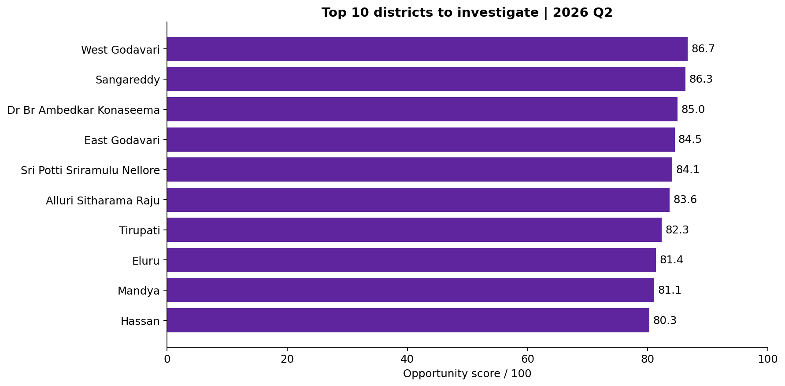

# PhonePe Digital Payments & Merchant Expansion Opportunity Analysis — 2026

**Python · Pandas · MySQL 8 · SQL · Power BI · DAX · Statistics**

An independent Data Analyst portfolio project answering: **Which states and districts should a merchant-growth team investigate first for merchant acquisition?**

The analysis covers **2018 Q1–2026 Q2**, with an expansion decision snapshot for **2026 Q2**. It uses real public data, documented cleaning checks, MySQL calculations, and a score tested under alternative assumptions. No machine learning is needed for this decision.

## Start here

1. [Business brief](docs/01_business_brief.md)
2. [Data dictionary](docs/02_data_dictionary.md)
3. [Cleaning and quality summary](docs/03_cleaning_and_quality.md)
4. [Scoring method and sensitivity](docs/04_scoring_method.md)
5. [Business recommendations](reports/business_recommendations.md)
6. [Interview walkthrough](docs/05_interview_walkthrough.md)
7. [Power BI project](powerbi/PhonePe.pbip) or the single-file `powerbi/PhonePe_Merchant_Expansion_2026.pbix`

## What the analysis found

- Q2 2026: **38.66 billion transactions**, **₹45.50 trillion value**, **711.65 million registered users**, and **50.71 million registered merchants**.
- 783 districts evaluated; 680 meet the main size/comparability rules; 624 meet positive-momentum investigation rules.
- West Godavari and Sangareddy lead the investigation score.
- Nine of the top ten remain with equal weights; six remain without transaction intensity.
- Seven of the ten are in Andhra Pradesh. This concentration is a reason for field validation, not a justification to allocate all budget there.

**Recommendation:** Start field research with the six candidates that remain in the top ten without intensity weighting. Keep the other four conditional. See the complete evidence and pilot proposal in the recommendations.



## Workflow


## Repository structure

```text
src/          Extraction, MySQL loading, statistical analysis
sql/          Model, KPI queries, scoring, business questions
data/         Cleaned tables, SQL exports, source provenance, validation
notebooks/    Executed learning and analysis walkthrough
powerbi/      Native Power BI project, single-file PBIX, data inputs and DAX
reports/      Business recommendations and EDA figures
docs/         Definitions, methods, setup and interview explanations
work/         Local raw download and tools; excluded from Git
```

## Data source and reproducibility

[Official PhonePe Pulse](https://github.com/PhonePe/pulse) under the CDLA-Permissive-2.0 data license.

- Pinned commit: `943e6e52a71513d683f804add12d0b61145e8007`
- Source retrieval: `2026-09-10T18:23:57.848090+00:00`
- Extracted rows: 1,224 state-quarter and 26,622 district-quarter records.
- Source hashes: `data/source_manifest.json`.
- SQL execution receipt: `data/sql_execution.json`.
- Independent verification: `data/analysis/validation.json`.

PhonePe restated its history in this release. Do not combine this series with older releases. Actual category labels are P2P, Retail and Utility; category counts are available at state level, while district totals combine all categories.

## Run locally

See [Setup and execution](docs/06_setup.md). Use the supplied cleaned CSVs to start quickly, or re-extract the pinned source. MySQL owns the KPI calculations and score; the Power BI import uses the resulting CSV exports so the report is portable.

## Portfolio integrity

This is a public-data portfolio case study, not a PhonePe employment claim. Pulse covers PhonePe's ecosystem, not the entire Indian UPI market. Registered merchants are cumulative registrations, not active shops. The score is a research prioritization aid, not a forecast or proof of saturation. No realized business impact is claimed.
