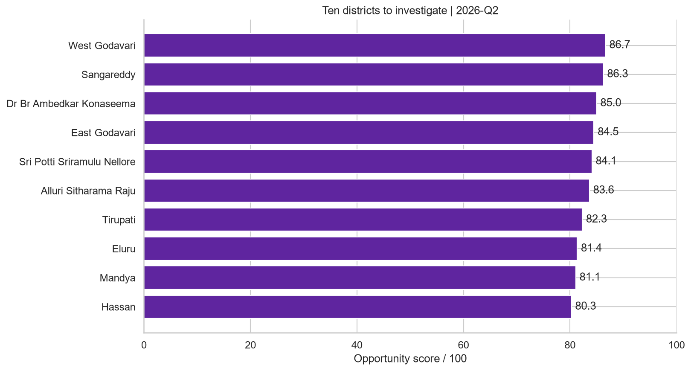

# PhonePe Digital Payments and Merchant Expansion Analysis

**Python · Pandas · MySQL 8 · SQL · Matplotlib · Seaborn · Power BI · DAX · Statistics**

This portfolio project answers one practical question: **which states and districts should a merchant-growth team investigate first for merchant acquisition?** It uses the pinned official PhonePe Pulse release from 2018 Q1 through 2026 Q2 and treats 2026 Q2 as the decision snapshot.

The analysis is descriptive and decision-oriented. It does not use machine learning, forecasting, A/B testing, or fabricated ROI assumptions.

## Executive result

- Q2 2026 recorded **38.66 billion transactions**, **INR 45.50 trillion in value**, **711.65 million registered users**, and **50.71 million registered merchants** in PhonePe's mapped ecosystem.
- All **783** latest-quarter districts are retained for EDA; **680** meet the scale and history rules for comparable scoring; **624** also meet the positive-momentum rules for the investigation queue.
- **West Godavari** and **Sangareddy** lead the default queue.
- Nine default top-ten districts remain under equal weights; six remain when transaction intensity is removed.
- Seven top-ten districts are in Andhra Pradesh. This concentration calls for local validation before budget concentration.

The recommendation is to begin field validation with the six candidates that remain in the no-intensity top ten: West Godavari, Sangareddy, Dr BR Ambedkar Konaseema, East Godavari, Sri Potti Sriramulu Nellore, and Alluri Sitharama Raju.



## Start here

1. [`01_data_validation.ipynb`](notebooks/01_data_validation.ipynb) — source provenance, analytical grain, nulls, coverage, category reconciliation, geography reconciliation, and 44 independent SQL/Pandas checks.
2. [`02_eda.ipynb`](notebooks/02_eda.ipynb) — complete latest-quarter descriptive statistics, univariate distributions for every analytical measure, national trends, category mix, geographic concentration, bivariate relationships, and scale-stratified multivariate analysis.
3. [`03_statistical_analysis.ipynb`](notebooks/03_statistical_analysis.ipynb) — robust summaries, outlier influence, full Spearman correlation structure, shared-denominator cautions, and within-state associations.
4. [`04_opportunity_analysis.ipynb`](notebooks/04_opportunity_analysis.ipynb) — eligibility, segments, score distributions, factor profiles, recent persistence, weight sensitivity, threshold sensitivity, and the final research queue.
5. [`06_business_questions.md`](sql/06_business_questions.md) — 15 numbered portfolio questions, each followed by clean MySQL, an explanation, and a decision-focused insight.
6. [`business_recommendations.md`](reports/business_recommendations.md) — recommendation, evidence, field-pilot measures, and decision limits.
7. [`PhonePe.pbip`](powerbi/PhonePe.pbip) or [`PhonePe_Merchant_Expansion_2026.pbix`](powerbi/PhonePe_Merchant_Expansion_2026.pbix) — the canonical Power BI project and portable single-file report.

## Analytical design


The SQL model preserves the union of transaction, user, and merchant geography-period keys, so historical missing observations remain unknown rather than disappearing through joins. MySQL owns the canonical ratios, growth measures, eligibility rules, scores, and ranks. Pandas independently recomputes each result from the processed source tables.

The opportunity score uses four percentile-ranked factors:

| Factor | Weight | Interpretation |
|---|---:|---|
| Transaction YoY growth | 30% | Same-quarter demand momentum |
| Transactions per merchant | 25% | Demand intensity proxy; includes P2P |
| Users per merchant | 25% | Relative registration-density gap |
| Registered users | 20% | Addressable ecosystem scale proxy |

Eligibility requires at least 100,000 registered users, 1,000 registered merchants, one million quarterly transactions, and comparable QoQ/YoY observations. The score prioritizes investigation; it is not a probability, forecast, or causal estimate.

## Repository structure

```text
src/phonepe_analytics/   Canonical extraction, transformation, validation, MySQL and analysis code
sql/                     Canonical schema, quality, metric, growth and scoring SQL plus questions
data/interim/            Source extracts and pinned-source provenance
data/processed/          Validated analytical tables and MySQL exports
notebooks/               Four executed, top-to-bottom portfolio walkthroughs
reports/eda_charts/      All generated EDA charts
reports/                 Business recommendation
powerbi/                 Canonical PBIP/PBIX assets, seven model inputs, and screenshot folder
tests/                   Focused transformation, validation and metric tests
```

## Reproduce the project

Requirements: `uv`, Python 3.12 or newer, and an isolated MySQL 8 database. Copy `.env.example` to `.env` and provide the five connection values.

```bash
uv sync
uv run python -m phonepe_analytics.extract --raw path/to/pinned/PhonePe-pulse
uv run python -m phonepe_analytics.transform
uv run python -m phonepe_analytics.validate
uv run python -m phonepe_analytics.database
uv run python -m phonepe_analytics.analysis
```

Execute and save all notebooks from the repository root with `nbclient` or Jupyter's execute-in-place command. Then run the quality gates:

```bash
uv run ruff format --check .
uv run ruff check .
uv run pytest
```

For Power BI, open the PBIP project, edit the `DataFolder` parameter to the absolute `powerbi/data` path on your machine, then refresh. The repository stores screenshots only in `powerbi/charts`.

## Data source and limits

- Source: [official PhonePe Pulse repository](https://github.com/PhonePe/pulse)
- Pinned commit: `943e6e52a71513d683f804add12d0b61145e8007`
- Coverage: 2018 Q1–2026 Q2
- Provenance and per-file hashes: [`data/interim/source_manifest.json`](data/interim/source_manifest.json)

PhonePe restated its history in the pinned release, so this series should not be combined with older releases. Pulse covers PhonePe's ecosystem rather than the whole Indian UPI market. Registered users and merchants are cumulative registrations rather than active participants. District transaction totals contain all categories, including P2P; category counts are available only at state level. The public data does not contain active acceptance, competitor coverage, local shop counts, acquisition cost, revenue, or realized business impact.
